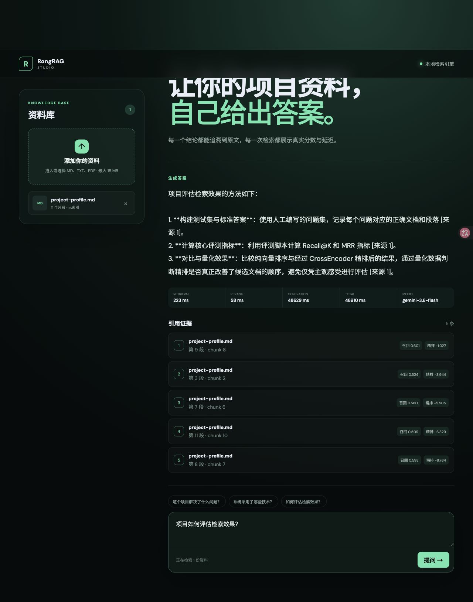
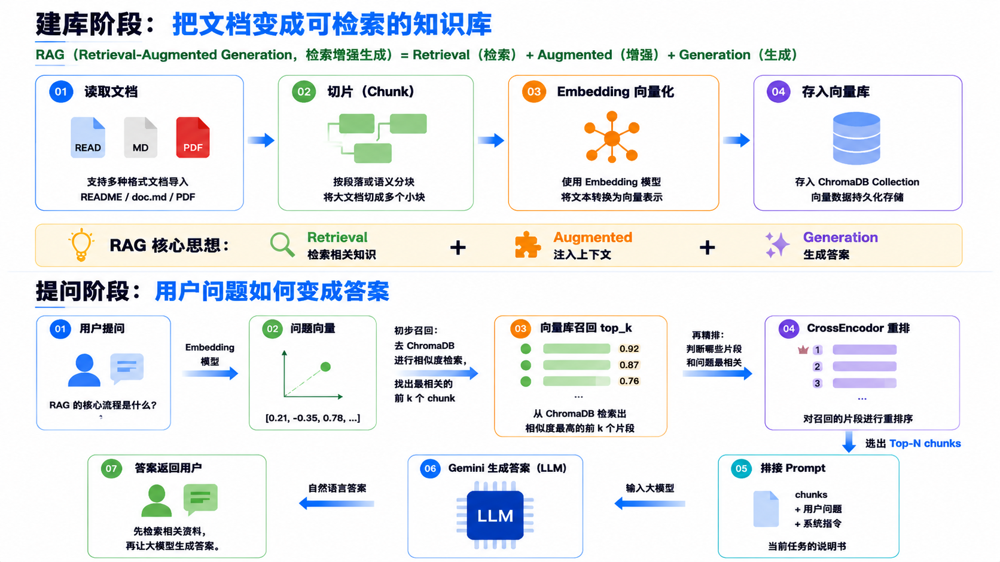

# RongRAG Studio

一个面向个人项目资料的可解释 RAG 问答系统。它不仅返回答案，也展示答案来自哪个文件、哪一页或段落，以及向量召回、CrossEncoder 精排和生成分别花了多长时间。





## 项目亮点

- Markdown、TXT、PDF 多格式解析，稳定文档 ID 与完整来源 metadata
- 本地中文 Embedding + ChromaDB 持久化向量召回
- CrossEncoder 精排，同时展示粗召回与精排分数
- Gemini 生成带 `[来源 N]` 标签的答案，未配置 Key 时仍可完成检索
- FastAPI 类型化接口与 React/TypeScript 交互界面
- Recall@K、MRR 评测脚本，以及检索/精排/生成分阶段延迟
- 上传文件、向量索引和密钥默认不进入 Git

## 工作流程

```text
MD / TXT / PDF
      │
      ▼
解析与重叠切片 ──► 中文 Embedding ──► ChromaDB 持久化索引
                                             │
用户问题 ──► 查询向量 ──► top-k 粗召回 ──► CrossEncoder 精排
                                             │
                                             ▼
                                来源标签 + Prompt ──► Gemini ──► 答案与证据
```

## 技术栈

| 层级 | 技术 |
| --- | --- |
| Web | React、TypeScript、Vite |
| API | FastAPI、Pydantic |
| 文档 | pypdf、UTF-8 Markdown/TXT 解析 |
| 检索 | text2vec 中文 Embedding、ChromaDB |
| 精排 | sentence-transformers CrossEncoder |
| 生成 | Google Gemini（环境变量配置） |
| 质量 | pytest、Vitest、ESLint、Ruff |

## 快速开始

环境要求：Python 3.12+、[uv](https://docs.astral.sh/uv/)、Node.js 20+。

```bash
git clone https://github.com/rongrongzang/rag_d.git
cd rag_d
cp .env.example .env
uv sync --dev
cd frontend && npm install && cd ..
```

如需生成答案，在 `.env` 中填写从 [Google AI Studio](https://aistudio.google.com/apikey) 获取的密钥：

```env
GEMINI_API_KEY=your_key_here
```

分别启动后端和前端：

```bash
uv run uvicorn backend.app.main:app --reload
```

```bash
cd frontend
npm run dev
```

首次打开 <http://localhost:5173> 时，页面会引导创建首位管理员；初始化只能执行一次，之后
使用登录页进入工作台。也可在 API 文档 <http://localhost:8000/api/docs> 调用
`POST /api/auth/bootstrap` 或 `POST /api/auth/login`，再把 Bearer 令牌填入右上角的
**Authorize**。健康检查和初始化状态可匿名访问，其余业务 API 默认要求有效会话。当前提供
最小认证入口；完整成员管理、系统状态和审计页面由后续 V4 页面任务实现。

生产配置应设置 `APP_ENVIRONMENT=production`，并把 `FRONTEND_ORIGIN` 设置为明确的
HTTPS 来源；多个来源使用英文逗号分隔。生产模式会关闭 OpenAPI 文档入口，且拒绝通配或
非 HTTPS 跨域来源。上传、请求体、登录频率、高成本请求频率及并发上限均可通过
`.env.example` 中的对应变量调整。

### 使用 Docker Compose

本机安装 Docker 后，可构建并启动前后端容器：

```bash
docker compose up --build -d
```

打开 <http://localhost:5173> 即可访问界面。前端会把 `/api` 请求转发到后端；健康检查地址为 <http://localhost:5173/api/health>。

如需启用 Gemini 生成，先在仓库根目录的 `.env` 中填写 `GEMINI_API_KEY`。Chroma 索引、上传文件和知识库清单分别保存在 Compose 命名卷中。停止并删除容器：

```bash
docker compose down
```

上述命令默认保留命名卷。如需同时删除本地容器数据，请明确执行 `docker compose down --volumes`。

### 部署 Render 免费 Demo

仓库根目录提供 `render.yaml`，用于创建前端静态站点和后端免费 Web Service，并在
`main` CI 通过后自动部署。首次创建 Blueprint 时需要在 Render 页面安全填写
`GEMINI_API_KEY`。完整创建步骤、临时数据边界、Demo 专用轻量模型和部署后冒烟验证见
[Render 免费 Demo 部署说明](docs/deployment/render-demo.md)。

## API

| 方法 | 地址 | 用途 |
| --- | --- | --- |
| `GET/POST` | `/api/auth/bootstrap` | 查询初始化状态或创建首位管理员；创建仅允许一次 |
| `POST` | `/api/auth/login` | 登录并创建可撤销 Bearer 会话 |
| `POST` | `/api/auth/logout` | 撤销当前会话 |
| `GET` | `/api/auth/me` | 获取当前成员及角色 |
| `GET/POST/PUT` | `/api/members` | 管理员查看、创建或更新成员 |
| `GET` | `/api/knowledge-bases/{id}/members` | 管理员查看知识库成员 |
| `PUT/DELETE` | `/api/knowledge-bases/{id}/members/{user_id}` | 管理员授予或撤销知识库成员 |
| `POST` | `/api/documents` | 上传并索引 MD、TXT 或 PDF |
| `GET` | `/api/documents` | 获取已索引文档及 chunk 数量 |
| `DELETE` | `/api/documents/{id}` | 删除文档、向量与本地上传文件 |
| `POST` | `/api/query` | 检索、精排并生成带来源答案 |
| `GET` | `/api/evaluations` | 按运行时间倒序获取正式检索评测报告 |
| `GET` | `/api/evaluations/{report_id}` | 获取单次正式检索评测报告详情 |
| `GET` | `/api/health` | 检查索引与模型配置状态 |
| `GET` | `/api/health/live` | 存活检查，不初始化重量模型 |
| `GET` | `/api/health/ready` | 检查认证、审计和业务存储是否就绪 |
| `GET` | `/api/system/metrics` | 管理员读取进程内请求、RAG 和索引指标 |
| `GET` | `/api/audit/events` | 管理员分页查询追加式审计事件 |
| `GET/POST` | `/api/knowledge-bases` | 列出或创建知识库 |
| `GET/PUT/DELETE` | `/api/knowledge-bases/{id}` | 查看、更新或删除空知识库 |
| `GET/POST` | `/api/knowledge-bases/{id}/documents` | 列出或上传指定知识库的文档 |
| `DELETE` | `/api/knowledge-bases/{id}/documents/{document_id}` | 删除指定知识库的文档 |
| `POST` | `/api/knowledge-bases/{id}/query` | 只检索指定知识库并生成答案 |
| `GET` | `/api/knowledge-bases/{id}/conversations` | 获取指定知识库的会话历史 |
| `GET` | `/api/knowledge-bases/{id}/conversations/{conversation_id}` | 获取会话及回答记录 |
| `DELETE` | `/api/knowledge-bases/{id}/conversations/{conversation_id}` | 删除会话及其回答记录 |
| `GET` | `/api/knowledge-bases/{id}/answers/{record_id}` | 获取单条回答、来源和执行元数据 |

查询请求示例：

```json
{
  "question": "项目如何保证回答可追溯？",
  "retrieve_k": 10,
  "rerank_k": 5
}
```

## 评测

先通过 Web 或 API 索引 `knowledge/project-profile.md`，再运行：

```bash
uv run python -m evaluations.evaluate
```

脚本基于 `evaluations/questions.json` 计算向量检索的 Recall@10、MRR 和精排后的 MRR。仓库只提供可复现的评测方法，不提交未经实际运行的结果数字。

当前演示知识库的实测结果（2026-08-02，4 个标注问题）：

| 指标 | 结果 |
| --- | ---: |
| 向量召回 Recall@10 | 1.000 |
| 向量排序 MRR | 0.688 |
| CrossEncoder 精排 MRR | 1.000 |

小规模演示集仅用于验证评测链路，不代表通用数据集表现。

V2 固定检索集的正式基线使用真实 embedding、CrossEncoder 和隔离的临时 ChromaStore 生成：

```bash
uv run python -m backend.evaluation.run_baseline \
  --dataset backend/evaluation/datasets/retrieval_v1.json \
  --commit "$(git rev-parse HEAD)" \
  --output backend/evaluation/reports/retrieval_v1_baseline.json
```

报告记录数据版本、模型 revision、代码提交、运行参数、Recall@5、向量 MRR、精排 MRR
及冻结质量门结论。正式报告必须由真实模型生成，测试替身结果不得写入该目录。

V2 融合排序以 15% 归一化向量分数和 85% 归一化 CrossEncoder 分数计算最终顺序。
固定数据集的正式结果如下，完整运行上下文见
`backend/evaluation/reports/retrieval_v1_optimized.json`：

| 指标 | V2 基线 | 融合排序 | 是否回退 |
| --- | ---: | ---: | --- |
| Recall@5 | 1.000 | 1.000 | 否 |
| 向量 MRR | 0.9083 | 0.9083 | 否 |
| 最终排序 MRR | 0.9667 | 0.9750 | 否 |

复现并与冻结基线比较：

```bash
uv run python -m backend.evaluation.run_baseline \
  --dataset backend/evaluation/datasets/retrieval_v1.json \
  --commit "$(git rev-parse HEAD)" \
  --baseline-report backend/evaluation/reports/retrieval_v1_baseline.json \
  --output backend/evaluation/reports/retrieval_v1_optimized.json
```

### V3 回答质量工具链

固定回答评测集位于 `backend/evaluation/datasets/answer_v1.json`，包含 30 个稳定样本：
20 个有充分证据的中文问答，以及 10 个证据不足、来源冲突、检索为空和生成失败场景。
每题记录知识库、参考要点、允许来源、禁止断言、期望状态及失败时是否必须保留来源。

回答运行记录必须包含被测 commit、数据集版本、Prompt 版本/哈希、模型标识、参数和逐题
API 结果。快速模式只执行引用编号与失败结构等确定性检查，不调用模型裁判：

```bash
uv run python -m backend.evaluation.run_answer_evaluation \
  --dataset backend/evaluation/datasets/answer_v1.json \
  --run /path/to/answer-run.json \
  --mode fast \
  --output /tmp/answer-fast-report.json
```

正式候选模式还要求每个可回答样本提供逐声明语义裁判结果，包括正确性、完整性、支持证据、
引用编号、是否有来源支持、是否与来源矛盾及归因是否正确：

```bash
uv run python -m backend.evaluation.run_answer_evaluation \
  --dataset backend/evaluation/datasets/answer_v1.json \
  --run /path/to/answer-run-with-judgements.json \
  --mode formal \
  --output /tmp/answer-formal-candidate.json
```

生成模型不能作为唯一裁判。工具链输出默认都是非正式候选报告；测试替身只验证计算和报告
结构，不能形成正式质量分数。正式基线、人工抽检和放行报告属于 V3 #44。

真实回答基线使用当前配置的 Gemini 生成模型和独立裁判模型逐题运行，并通过检查点支持免费
额度下的断点恢复：

```bash
uv run python -m backend.evaluation.run_answer_baseline \
  --dataset backend/evaluation/datasets/answer_v1.json \
  --corpus backend/evaluation/datasets/retrieval_v1.json \
  --commit "$(git rev-parse HEAD)" \
  --judge-model gemini-3.1-flash-lite \
  --checkpoint /tmp/answer-baseline-checkpoint.json \
  --run-output /tmp/answer-baseline-run.json \
  --report-output /tmp/answer-baseline-report.json
```

运行器每完成一题便原子写入检查点；配额恢复后用相同参数重跑会跳过已完成样本。只有全部
冻结指标通过，并由人工复核全部失败样本及至少 20% 的可回答样本后，候选报告才允许标记
为正式报告。检查点和包含模型原始答案的运行文件默认保留在临时目录，不提交到仓库。

正式回答报告存放在 `backend/evaluation/reports/answers/`，与顶层 V2 检索报告隔离；现有
检索报告 API 不会把回答报告误解析为检索指标。回答报告的只读 API 和页面属于 V3 #45。

## 测试与质量检查

```bash
uv run pytest
uv run ruff check backend evaluations
cd frontend
npm test
npm run lint
npm run build
```

## 数据与隐私

- `.env`、`data/uploads/` 和 `data/chroma/` 已加入 `.gitignore`。
- 上传只接受安全文件名及 MD、TXT、PDF 类型，并校验大小、MIME 和基础内容特征；原始
  上传文件以仅当前服务用户可读写的权限落盘。接口响应默认禁止缓存并设置基础安全头。
- 登录和上传/问答等高成本请求设置进程内滑动窗口限流；高成本任务还受并发上限保护。
  这是单实例基础保护，不冒充外部 WAF 或多实例共享限流。
- 参数校验和未预期异常只返回稳定错误码，不回传密码、令牌、请求原文或内部异常文本。
- 每个 API 请求都有 `X-Request-ID`，结构化日志只记录路由模板、状态、耗时和匿名主体；
  不记录查询字符串、请求体或业务正文。管理员可读取请求、RAG 与索引聚合指标。
- 审计事件以哈希链追加保存于 `data/audit/`，覆盖登录、成员/权限、知识库和文档变更；
  只读接口仅管理员可访问。审计记录不包含问题、答案、Prompt、令牌、密钥或文件正文。
- 账号、密码摘要、会话摘要和知识库授权位于 `data/auth/`；密码使用带随机盐的 scrypt
  摘要，会话只保存令牌 SHA-256 摘要，原始密码和原始令牌不会写入存储文件。

备份清单、完整性校验、隔离恢复演练、测试 RPO/RTO 口径、数据保留和故障回滚步骤见
[备份恢复与数据生命周期运行手册](docs/operations/backup-recovery.md)。恢复工具强制使用空目标目录，
不会覆盖现有数据；Render 或其他正式环境恢复仍须另行批准。

V4 的 Tag 质量门、GHCR 不可变镜像、制品清单、GitHub Release 和前一版本隔离回滚流程见
[V4 版本发布与受控回滚](docs/operations/release-rollback.md)。发布必须由明确批准的 `v4.x.y`
Tag 触发；普通 PR 不创建版本制品，也不会触发 Render 部署。

V4 的生产就绪验收范围、证据索引、已知限制与 V0→V4 总复盘见
[V4 生产就绪验收报告](docs/reports/v4-readiness.md)。版本 commit、镜像摘要和回滚记录以
GitHub Release 附件为准，不在报告中复制维护。
- 管理员可访问全部知识库；普通成员只看到被明确授权的知识库。服务端对未授权知识库统一
  返回“未找到”，避免通过错误差异探测资源是否存在。正式评测和成员管理仅管理员可访问。
- V3 起每个文档和来源都带有 `knowledge_base_id`；V2 数据统一迁入稳定的默认知识库
  `kb_default`，原始文件存放于 `data/uploads/kb_default/`。
- Chroma 启动时会为缺少 `knowledge_base_id` 的 V2 chunk 补上默认值；迁移可重复执行，
  不会复制 chunk。旧上传文件与新目录存在内容冲突时会停止迁移，不会静默覆盖。
- 原 V2 文档和查询 API 继续映射默认知识库；V3 作用域 API 通过路径中的
  `knowledge_base_id` 严格隔离上传文件、Chroma 检索与删除操作。
- 默认知识库不能删除；其他知识库包含文档时也不能删除，必须先明确删除其中的文档。
- 每次有效查询都会保存成功或失败记录，包括来源快照、分段耗时、模型集合、Prompt
  版本/哈希及稳定错误码；只保存 Prompt 哈希，不保存完整 Prompt。
- 会话和回答记录位于 `data/conversations/`，并严格绑定 `knowledge_base_id`；Render
  免费演示环境仍只保证当前实例生命周期内可用，不承诺跨休眠或重新部署保留。
- 演示资料由项目作者编写，不包含真实电话、邮箱或访问令牌。
- 不建议把包含个人敏感信息的索引目录或 API 原始响应公开提交。
- V4 威胁边界、已缓解风险与延期项见
  [`docs/security/v4-threat-model.md`](docs/security/v4-threat-model.md)。

## 独立实现与致谢

本项目是为个人作品集从零设计和实现的工程项目，不宣称原创 RAG 算法。学习过程中参考了[马克的技术工作坊：使用 Python 构建 RAG 系统](https://github.com/MarkTechStation/VideoCode/tree/main/%E4%BD%BF%E7%94%A8Python%E6%9E%84%E5%BB%BARAG%E7%B3%BB%E7%BB%9F/rag)所介绍的通用流程。原仓库未提供开源许可证，因此本项目未复制其代码、README 文案或示例文档，仅在此注明概念学习来源。

## License

本仓库暂未添加开源许可证，默认保留所有权利。如需授权复用，请先联系仓库作者。
