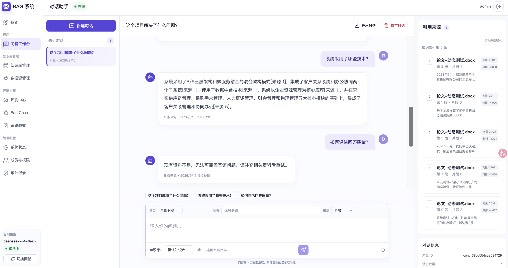
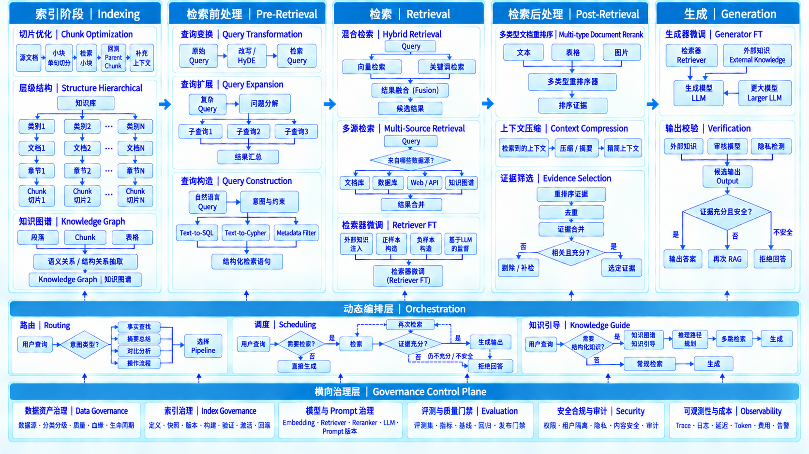

# RongRAG Studio

一个面向个人项目资料的可解释 RAG（检索增强生成）问答系统。它不仅生成答案，还展示答案来自哪个文件、哪一页或段落，以及向量召回、精排和生成分别耗时多久。





## 适合谁

- **快速体验**：上传一份 Markdown、TXT 或 PDF，直接提问并查看引用来源。
- **技术评审**：沿着真实代码和评测脚本，检查解析、切片、Embedding、向量检索、CrossEncoder 精排和生成链路。

## 当前能力

- 支持 Markdown、TXT、PDF 解析，并保留文件、页码、段落和 chunk 等来源信息。
- 使用本地中文 Embedding 和 ChromaDB 进行持久化向量检索。
- 使用 CrossEncoder 对粗召回结果精排，同时返回召回分数和精排分数。
- 配置 Gemini 后生成带 `[来源 N]` 标签的答案；未配置 Key 时仍可完成检索。
- 提供 FastAPI 接口和 React/TypeScript 页面，展示检索、精排、生成三个阶段的结果与耗时。
- 提供 Recall@K、MRR 和精排 MRR 评测脚本。

## 当前边界

当前版本定位为**单知识库、本地运行的 RAG 实践项目**：

- 上传文件、Chroma 索引和配置文件保存在本地；没有登录、权限和多租户隔离。
- 当前页面聚焦“文档上传 + 问答 + 来源查看”，不包含正式生产部署或云端运维能力。
- 评测脚本用于验证检索链路和比较实验结果，不等同于通用数据集上的质量承诺。

## 核心流程

```text
MD / TXT / PDF
      │
      ▼
解析与重叠切片 ──► 中文 Embedding ──► ChromaDB 持久化索引
                                             │
用户问题 ──► 查询向量 ──► top-k 粗召回 ──► CrossEncoder 精排
                                             │
                                             ▼
                                来源标签 + Prompt ──► Gemini ──► 答案与证据
```

## 技术栈

| 层级 | 技术 |
| --- | --- |
| Web | React、TypeScript、Vite |
| API | FastAPI、Pydantic |
| 文档 | pypdf、UTF-8 Markdown/TXT 解析 |
| 检索 | `text2vec` 中文 Embedding、ChromaDB |
| 精排 | `sentence-transformers` CrossEncoder |
| 生成 | Google Gemini（环境变量配置） |
| 质量 | pytest、Vitest、ESLint、Ruff |

## 快速开始

### 1. 准备环境

- Python 3.12+
- [uv](https://docs.astral.sh/uv/)
- Node.js 20+

### 2. 安装依赖

```bash
git clone https://github.com/ai-agent-lab-cn/rag-enterprise.git
cd rag-enterprise
cp .env.example .env
uv sync --dev
cd frontend
npm ci
cd ..
```

如需生成答案，在 `.env` 中填写从 [Google AI Studio](https://aistudio.google.com/apikey) 获取的密钥：

```env
GEMINI_API_KEY=your_key_here
```

没有配置 `GEMINI_API_KEY` 时，仍可启动服务、上传文档并验证检索结果；生成答案会进入不可用状态。

### 3. 启动服务

在两个终端分别运行：

```bash
# 终端一：后端
uv run uvicorn backend.app.main:app --reload
```

```bash
# 终端二：前端
cd frontend
npm run dev
```

打开 <http://localhost:5173>，上传 `knowledge/project-profile.md` 后即可提问。FastAPI 文档位于 <http://localhost:8000/api/docs>。

### 4. 使用 Docker Compose

本机安装 Docker 后，可直接构建并启动前后端：

```bash
docker compose up --build -d
```

打开 <http://localhost:5173>；健康检查地址为 <http://localhost:5173/api/health>。停止容器：

```bash
docker compose down
```

该命令默认保留 Chroma 索引和上传文件所在的命名卷。如需同时删除容器数据，请明确执行 `docker compose down --volumes`。

## 一次完整体验

1. 打开问答页面，上传 `knowledge/project-profile.md`。
2. 等待文档索引完成，确认文档列表出现 chunk 数量。
3. 输入“项目如何保证回答可追溯？”等问题。
4. 查看答案中的来源编号，并在来源卡片中核对文件、页码或段落。
5. 需要技术细节时，查看返回的召回分数、精排分数和阶段耗时。

## API

| 方法 | 地址 | 用途 |
| --- | --- | --- |
| `POST` | `/api/documents` | 上传并索引 Markdown、TXT 或 PDF |
| `GET` | `/api/documents` | 获取已索引文档及 chunk 数量 |
| `DELETE` | `/api/documents/{document_id}` | 删除文档、向量和本地上传文件 |
| `POST` | `/api/query` | 执行检索、精排并生成带来源答案 |
| `GET` | `/api/health` | 检查索引和模型配置状态 |

查询请求示例：

```json
{
  "question": "项目如何保证回答可追溯？",
  "retrieve_k": 10,
  "rerank_k": 5
}
```

完整请求和响应模型可在 <http://localhost:8000/api/docs> 查看。

## 检索评测

先通过 Web 页面或 API 索引 `knowledge/project-profile.md`，再运行：

```bash
uv run python -m evaluations.evaluate
```

脚本读取 `evaluations/questions.json`，计算：

- `Recall@10`：正确来源是否出现在前 10 个召回结果中。
- `MRR`：正确来源在排序结果中的倒数排名。
- `reranked_mrr`：经过 CrossEncoder 精排后的 MRR。

评测结果依赖本地模型、索引内容和运行环境。README 不把某一次本地运行结果当作通用质量承诺；如果要比较改动，应同时记录数据集、模型、参数、commit 和运行时间。

## 测试与质量检查

```bash
# 后端单元测试与静态检查
uv run pytest
uv run ruff check backend evaluations

# 前端测试、Lint 和构建
cd frontend
npm test
npm run lint
npm run build
```

## 数据与隐私

- `.env`、`data/uploads/` 和 `data/chroma/` 已加入 `.gitignore`。
- 示例资料由项目作者编写，不包含真实电话、邮箱或访问令牌。
- 不要提交包含个人敏感信息的原始文件、索引目录或 API 原始响应。
- Docker Compose 使用命名卷保存 Chroma 索引和上传文件；删除卷会清除这些本地数据。

## 后续方向

在当前单知识库 MVP 之上，后续可以独立演进多知识库、历史会话、回答质量评测、登录权限、审计和正式部署。这些能力不属于当前 README 所描述的已完成范围。

## 独立实现与致谢

本项目是为个人作品集从零设计和实现的工程项目，不宣称原创 RAG 算法。学习过程中参考了[马克的技术工作坊：使用 Python 构建 RAG 系统](https://github.com/MarkTechStation/VideoCode/tree/main/%E4%BD%BF%E7%94%A8Python%E6%9E%84%E5%BB%BARAG%E7%B3%BB%E7%BB%9F/rag)所介绍的通用流程。原仓库未提供开源许可证，因此本项目未复制其代码、README 文案或示例文档，仅在此注明概念学习来源。

## License

本仓库暂未添加开源许可证，默认保留所有权利。如需授权复用，请先联系仓库作者。
